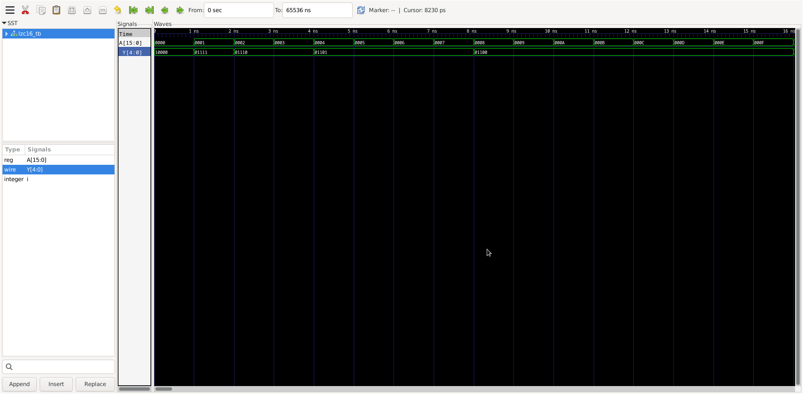

# 🔢 16-bit Zero Leading Counter (ZLC) — SKY130A ASIC Design

---

## 📋 Table of Contents

1. [What is ZLC?](#what-is-zlc)
2. [Architecture](#architecture)
3. [Design Flow](#design-flow)
4. [Schematic Design (Xschem)](#schematic-design-xschem)
5. [Functional Simulation (iverilog)](#functional-simulation-iverilog)
6. [Static Timing Analysis (OpenSTA)](#static-timing-analysis-opensta)
7. [Physical Layout (Magic)](#physical-layout-magic)
8. [LVS Verification (Netgen)](#lvs-verification-netgen)
9. [Summary of Results](#summary-of-results)
10. [File Structure](#file-structure)
11. [How to Run (Step by Step)](#how-to-run-step-by-step)
12. [Tools Required](#tools-required)
13. [Team](#team)

---

## What is ZLC?

The **Zero Leading Counter** (also called **Leading Zero Counter — LZC**) counts the number of consecutive zero bits starting from the **Most Significant Bit (MSB)** of a 16-bit input word.

This module is widely used in:
- **Floating-point normalization** (IEEE 754)
- **Priority encoders**
- **Data compression** algorithms
- **Branch prediction** units in CPUs

### Input / Output Specification

| Signal | Width | Direction | Description |
|--------|-------|-----------|-------------|
| `A[15:0]` | 16 bits | Input | Data word to count leading zeros |
| `Y[4:0]` | 5 bits | Output | Number of leading zeros (0 to 16) |

### Example Behavior

| Input `A[15:0]` (binary) | Input (hex) | Output `Y[4:0]` | Explanation |
|---|---|---|---|
| `0001_0110_0010_0000` | `0x1620` | `3` | 3 zeros before first '1' |
| `1000_0000_0000_0000` | `0x8000` | `0` | MSB is '1', no leading zeros |
| `0000_0000_0000_0001` | `0x0001` | `15` | 15 zeros before bit 0 |
| `0100_0000_0000_0000` | `0x4000` | `1` | 1 zero before bit 14 |
| `0000_0001_0000_0000` | `0x0100` | `7` | 7 zeros before bit 8 |
| `0000_0000_0000_0000` | `0x0000` | `16` | Special case: all zeros |
| `1111_1111_1111_1111` | `0xFFFF` | `0` | No leading zeros |

---

## Architecture

### Design Approach: Hierarchical LZC Tree

Instead of scanning all 16 bits sequentially (slow, O(n)), we use a **divide-and-conquer tree** that processes all bits in parallel with O(log n) delay.

The key insight: split the input into **left half** and **right half**:
- If the left half has any '1' → the count comes from the left half
- If the left half is all zeros → add half-width and look at the right half

### Tree Structure (4 levels)

```
Level 0 (Leaf):     8× lzc2   — process 2-bit pairs
Level 1 (Combine):  4× lzc4   — combine pairs → 4-bit blocks  
Level 2 (Combine):  2× lzc8   — combine blocks → 8-bit halves
Level 3 (Top):      1× lzc16  — combine halves → final 16-bit result
```

```
                    A[15:0] (16-bit input)
                         │
    ┌────────────────────┴────────────────────┐
    │                                          │
  A[15:8]                                   A[7:0]
    │                                          │
  ┌─┴──┐  ┌──┴─┐                          ┌──┴─┐  ┌──┴─┐
 [15:14] [13:12] [11:10] [9:8]          [7:6]  [5:4]  [3:2]  [1:0]
    │       │       │      │               │      │      │      │
  lzc2    lzc2    lzc2   lzc2           lzc2   lzc2   lzc2   lzc2
  #0      #1      #2     #3             #4     #5     #6     #7
    │       │       │      │               │      │      │      │
    └───┬───┘       └──┬───┘               └──┬───┘      └──┬───┘
      lzc4            lzc4                   lzc4          lzc4
       #0              #1                     #2            #3
        │               │                     │              │
        └───────┬───────┘                     └──────┬───────┘
              lzc8_L                               lzc8_R
                │                                     │
                └─────────────┬───────────────────────┘
                            lzc16
                              │
                           Y[4:0]
```

### Combine Logic (used at every level)

Each combine node takes outputs from left and right children:

```verilog
// Inputs from children:
//   vL, pL  = valid bit and position from LEFT child
//   vR, pR  = valid bit and position from RIGHT child

V       = vL | vR           // OR: is there any '1' in either half?
sel     = ~vL               // INV: if left is all-zero, select right
P_high  = sel               // new MSB of position = sel
P_low   = sel ? pR : pL     // MUX: pick right or left position bits
```

### Output Gating (special case: all zeros)

When the entire 16-bit input is zero (`A = 0x0000`), `V_top = 0` and `Y` should be 16:

```verilog
Y[4]   = ~V_top              // INV: Y[4]=1 when all zeros → Y=16
Y[3:0] = P[3:0] & {4{V_top}} // AND: mask position bits to 0 when all zeros
```

### lzc2 — Leaf Cell (2-bit input)

The simplest building block:

```
        ┌──────────┐
HI ────►│ A        │
        │   or2_1  ├──── V = HI | LO  (any bit is '1'?)
LO ────►│ B        │
        └──────────┘
HI ────►│ A        │
        │   inv_1  ├──── P = ~HI  (position: 0 if HI=1, 1 if LO=1)
        └──────────┘
```

Cells: 1× `or2_1` + 1× `inv_1` = **2 cells**

### Cell Count Summary

| Cell Type | Count | Function |
|-----------|-------|----------|
| `sky130_fd_sc_hd__or2_1`  | 15 | Valid bit OR (V = vL \| vR) |
| `sky130_fd_sc_hd__inv_1`  | 16 | Select/invert (~vL, ~V_top) |
| `sky130_fd_sc_hd__mux2_1` | 11 | Position multiplexer |
| `sky130_fd_sc_hd__and2_1` |  4 | Output gating (Y & V_top) |
| **Total** | **46** | |

---

## Design Flow

```
┌─────────────────────────────────────────────────────────┐
│                    DESIGN FLOW                           │
├─────────────────────────────────────────────────────────┤
│                                                          │
│   ① RTL Design (Verilog)                                │
│   │  lzc2.v → lzc4.v → lzc8.v → lzc16.v               │
│   │                                                      │
│   ▼                                                      │
│   ② Functional Simulation (iverilog + GTKWave)          │
│   │  5007/5007 test cases PASSED ✅                      │
│   │                                                      │
│   ▼                                                      │
│   ③ Schematic Capture (Xschem)                          │
│   │  lzc2.sch → lzc4.sch → lzc8.sch → lzc16.sch       │
│   │  Export: structural Verilog + SPICE netlist          │
│   │                                                      │
│   ▼                                                      │
│   ④ Static Timing Analysis (OpenSTA)                    │
│   │  Critical path: 1.31 ns → Max clock: 662 MHz       │
│   │  Power: 0.057 µW @ 1MHz                             │
│   │                                                      │
│   ▼                                                      │
│   ⑤ Physical Layout (Magic + SKY130A)                   │
│   │  46 cells placed in 7 rows                           │
│   │  Area: 604 µm² | Aspect: 1.20:1 | DRC: 0 ✅        │
│   │                                                      │
│   ▼                                                      │
│   ⑥ Extraction + LVS (Netgen)                           │
│   │  Device count: 46/46 match ✅                        │
│   │                                                      │
│   ▼                                                      │
│   ⑦ Post-layout Simulation (ngspice) [future work]     │
│                                                          │
└─────────────────────────────────────────────────────────┘
```

---

## Schematic Design (Xschem)

The schematic was designed hierarchically in **Xschem**, matching the tree architecture exactly.

### lzc2 — Leaf Schematic

<!-- 📸 THÊM ẢNH: Chụp Xschem lzc2.sch (mở xschem lzc2.sch, chụp toàn màn hình) -->
<!--  -->
> **📸 Cần thêm ảnh:** Chụp màn hình `xschem lzc2.sch` — schematic leaf cell 2-bit

- 1× `sky130_fd_sc_hd__or2_1` — tạo valid bit V
- 1× `sky130_fd_sc_hd__inv_1` — tạo position bit P

### lzc4 — Level 1 Schematic

<!-- 📸 THÊM ẢNH: Chụp Xschem lzc4.sch -->
<!--  -->
> **📸 Cần thêm ảnh:** Chụp màn hình `xschem lzc4.sch`

- 2× `lzc2` subcells + combine logic (or2 + inv + mux2)
- Total: 7 primitive cells

### lzc8 — Level 2 Schematic

<!-- 📸 THÊM ẢNH: Chụp Xschem lzc8.sch -->
<!--  -->
> **📸 Cần thêm ảnh:** Chụp màn hình `xschem lzc8.sch`

- 2× `lzc4` subcells + combine logic (or2 + inv + 2×mux2)
- Total: 18 primitive cells

### lzc16 — Top Level Schematic

<!-- 📸 THÊM ẢNH: Chụp Xschem lzc16.sch -->
<!--  -->
> **📸 Cần thêm ảnh:** Chụp màn hình `xschem lzc16.sch` — schematic top-level 16-bit

- 2× `lzc8` subcells
- Combine: or2 + inv + 3×mux2
- Output gating: inv + 4×and2
- Total: **46 primitive cells**

---

## Functional Simulation (iverilog)

### Testbench Strategy

The testbench uses a **self-checking** approach:
1. **DUT** (Device Under Test): structural netlist from Xschem using sky130 cells
2. **Golden reference**: behavioral loop-based model (`zlc_ref.v`)
3. For each test vector: compare DUT output vs reference

### Test Vectors

| Type | Count | Description |
|------|-------|-------------|
| Directed tests | 7 | Edge cases: all-0, all-1, MSB=1, LSB=1, etc. |
| Random tests | 5000 | `$random` stimulus |
| **Total** | **5007** | |

### Simulation Result

```
------ TEST PASSED: all 5007 cases match ------
```

### Waveform

<!-- 📸 THÊM ẢNH: Chụp GTKWave waveform -->
<!--  -->
> **📸 Cần thêm ảnh:** Mở `gtkwave lzc16.vcd`, add signals A[15:0] và Y[4:0], chụp màn hình

**Cách chụp waveform:**
```bash
cd iverilog/
gtkwave lzc16.vcd &
# Trong GTKWave: click "lzc16_tb" → kéo A[15:0] và Y[4:0] vào waveform → chụp ảnh
```

---

## Static Timing Analysis (OpenSTA)

### Setup

- **Liberty file:** `sky130_fd_sc_hd__tt_025C_1v80.lib`
- **Corner:** Typical-Typical, 25°C, 1.8V
- **Netlist:** structural Verilog from Xschem

### Timing Results

| Metric | Value |
|--------|-------|
| **Critical path delay** | **1.31 ns** |
| Critical path | `A3 → or2 → inv → mux → mux → and2 → Y0` |
| **Max clock frequency** | **662 MHz** |
| **Throughput** | **662 Mops/s** |
| Setup slack @ 10ns | +8.49 ns (MET ✅) |
| Hold slack | +0.40 ns (MET ✅) |

### Power Analysis

| Clock frequency | Total power | Breakdown |
|-----------------|-------------|-----------|
| 1 MHz | **0.057 µW** | Mostly leakage |
| 100 MHz | 5.71 µW | Balanced switching + leakage |
| 662 MHz (max) | **37.8 µW** | Dominated by switching |

### STA Run Logs

<!-- 📸 THÊM ẢNH (optional): Chụp terminal output của OpenSTA -->
<!--  -->
> **📸 Tùy chọn:** Chụp terminal khi chạy `sta lzc16_max.tcl` — hiện timing report

---

## Physical Layout (Magic)

### Floorplan

The 46 cells are arranged in **7 rows** with row spacing of 340 λ (3.4 µm):

| Row | Level | Contents | Cells | Width (µm) |
|-----|-------|----------|-------|------------|
| 1 | L0 | lzc2 #0..#3 | 4×(or2+inv) = 8 | 17.76 |
| 2 | L0 | lzc2 #4..#7 | 4×(or2+inv) = 8 | 17.76 |
| 3 | L1 | lzc4 combine #0..#1 | 2×(or2+inv+mux) = 6 | 17.92 |
| 4 | L1 | lzc4 combine #2..#3 | 2×(or2+inv+mux) = 6 | 17.92 |
| 5 | L2 | lzc8 combine | 2×(or2+inv+2×mux) = 8 | **26.96** |
| 6 | L3 | lzc16 combine | or2+inv+3×mux = 5 | 18.00 |
| 7 | L3 | Output gating | inv+4×and2 = 5 | 12.48 |

### Layout Metrics

| Metric | Value |
|--------|-------|
| **Total area** | **~604 µm²** |
| Width × Height | 26.96 × 22.40 µm |
| **Aspect ratio** | **1.20 : 1** (near-square ✅) |
| **DRC errors** | **0** ✅ |
| Technology | sky130A |

### Layout Screenshot (unexpanded — cell view)

<!-- 📸 THÊM ẢNH: Chụp Magic layout CHƯA expand (thấy 7 hàng cells) -->
<!--  -->
> **📸 Cần thêm ảnh:** Mở Magic → `view` → chụp layout overview (7 hàng cells)

**Cách chụp:**
```bash
cd magic/
magic -d XR -T sky130A lzc16 &
# Trong tkcon: view
# Chụp cửa sổ layout1
```

### Layout Screenshot (expanded — transistor view)

<!-- 📸 THÊM ẢNH: Chụp Magic layout ĐÃ expand (thấy transistors bên trong cells) -->
<!--  -->
> **📸 Cần thêm ảnh:** Trong Magic → bấm `x` để expand → chụp layout chi tiết

### DRC Check

```
% drc check
% drc count
Total DRC errors found: 0
```

<!-- 📸 THÊM ẢNH (optional): Chụp tkcon hiện DRC=0 -->
<!--  -->
> **📸 Tùy chọn:** Chụp tkcon window hiện "Total DRC errors found: 0"

---

## LVS Verification (Netgen)

### LVS Comparison

| | Layout (Magic) | Schematic (Xschem) |
|---|---|---|
| `inv_1` | 16 | 16 ✅ |
| `or2_1` | 15 | 15 ✅ |
| `mux2_1` | 11 | 11 ✅ |
| `and2_1` | 4 | 4 ✅ |
| **Total devices** | **46** | **46** ✅ |

### LVS Command

```bash
netgen -batch lvs \
  "magic/lzc16.spice lzc16" \
  "xschem/lzc16.spice lzc16" \
  /usr/local/share/pdk/sky130A/libs.tech/netgen/sky130A_setup.tcl \
  lvs.out
```

### LVS Result

```
Circuit 1 contains 46 devices, Circuit 2 contains 46 devices.
Device classes lzc16 and lzc16 are equivalent.
```

<!-- 📸 THÊM ẢNH (optional): Chụp terminal output của netgen LVS -->
<!--  -->
> **📸 Tùy chọn:** Chụp terminal hiện LVS device match

---

## Summary of Results

| Category | Metric | Value | Status |
|----------|--------|-------|--------|
| **Simulation** | Test cases | 5007/5007 | ✅ PASS |
| **Timing** | Max clock | 662 MHz | ✅ |
| **Timing** | Critical path | 1.31 ns | ✅ |
| **Timing** | Setup slack | +8.49 ns | ✅ MET |
| **Timing** | Hold slack | +0.40 ns | ✅ MET |
| **Power** | @ 1 MHz | 0.057 µW | ✅ |
| **Power** | @ max clock | 37.8 µW | ✅ |
| **Layout** | Area | ~604 µm² | ✅ |
| **Layout** | Aspect ratio | 1.20:1 | ✅ |
| **Layout** | DRC | 0 errors | ✅ |
| **LVS** | Device match | 46/46 | ✅ |

---

## File Structure

```
frontend/
│
├── xschem/                     ← Schematic capture (Xschem)
│   ├── lzc2.sch                # Leaf cell schematic — 2-bit
│   ├── lzc2.sym                # Leaf cell symbol
│   ├── lzc4.sch  + lzc4.sym    # Level 1 — 4-bit
│   ├── lzc8.sch  + lzc8.sym    # Level 2 — 8-bit
│   ├── lzc16.sch + lzc16.sym   # Top level — 16-bit
│   ├── lzc2.v                  # Exported Verilog netlist
│   ├── lzc4.v
│   ├── lzc8.v
│   ├── lzc16.v                 # Top-level structural netlist
│   ├── lzc2.spice              # Exported SPICE netlist
│   ├── lzc4.spice
│   ├── lzc8.spice
│   ├── lzc16.spice             # Top-level SPICE
│   ├── tb_lzc16.v              # Xschem testbench
│   └── xschemrc                # Xschem config
│
├── iverilog/                   ← Functional simulation
│   ├── lzc16.v                 # Netlist (copy from xschem)
│   ├── lzc16_tb.v              # Self-checking testbench
│   ├── zlc_ref.v               # Golden reference model
│   └── lzc16.vcd               # Waveform dump
│
├── opensta/                    ← Static Timing Analysis
│   ├── lzc16.v                 # Netlist for STA
│   ├── lzc16.tcl               # STA script @ 10ns period
│   ├── lzc16_max.tcl           # STA script @ max clock (1.51ns)
│   ├── lzc16_1mhz.tcl          # Power analysis @ 1MHz
│   ├── lzc16_run1.log          # STA run log @ 10ns
│   ├── lzc16_run2.log          # STA run log @ max clock
│   └── lzc16_run3.log          # Power run log @ 1MHz
│
├── magic/                      ← Physical layout (Magic VLSI)
│   ├── lzc16.mag               # Layout file — 46 cells placed
│   ├── place2.tcl              # Automated placement script
│   ├── lzc16.spice             # Extracted SPICE netlist
│   ├── lzc16.ext               # Extraction file
│   ├── lzc16.def               # DEF export
│   └── .magicrc                # Magic config for sky130A
│
├── images/                     ← Screenshots for documentation
│   ├── sch_lzc2.png            # Schematic lzc2
│   ├── sch_lzc4.png            # Schematic lzc4
│   ├── sch_lzc8.png            # Schematic lzc8
│   ├── sch_lzc16.png           # Schematic lzc16 (top)
│   ├── waveform.png            # GTKWave simulation waveform
│   ├── layout_unexpanded.png   # Magic layout (cell view)
│   ├── layout_expanded.png     # Magic layout (transistor view)
│   ├── drc_result.png          # DRC = 0 screenshot
│   ├── sta_output.png          # OpenSTA timing report
│   └── lvs_result.png          # Netgen LVS result
│
├── README.md                   ← This file
└── README_handoff.md           ← Backend engineer handoff guide
```

---

## How to Run (Step by Step)

### Prerequisites

All tools are pre-installed in the **OSIC Debian VM** (VirtualBox).  
PDK location: `/usr/local/share/pdk/sky130A/`

---

### Step 1 — Clone the Repository

```bash
git clone https://github.com/dungtran1109/group-02-vlsi-16-bit-zlc-counter.git
cd group-02-vlsi-16-bit-zlc-counter/frontend
```

---

### Step 2 — Open Schematic in Xschem

```bash
cd xschem/
xschem lzc16.sch &
```

**Navigate hierarchy:**
- Click on `lzc8` subcell → press **`E`** to descend into it
- Inside lzc8, click `lzc4` → press **`E`** again
- Inside lzc4, click `lzc2` → press **`E`** to see leaf cell
- Press **`Ctrl+E`** to go back up one level

**Export netlist:** Menu → **Netlist** → generates `lzc16.v` and `lzc16.spice`

---

### Step 3 — Run Functional Simulation

```bash
cd iverilog/

# Compile with sky130 cell models
iverilog -g2012 -o lzc16_sim \
    lzc16.v lzc16_tb.v zlc_ref.v \
    /usr/local/share/pdk/sky130A/libs.ref/sky130_fd_sc_hd/verilog/sky130_fd_sc_hd.v \
    /usr/local/share/pdk/sky130A/libs.ref/sky130_fd_sc_hd/verilog/primitives.v

# Run
vvp lzc16_sim
# Expected: ------ TEST PASSED: all 5007 cases match ------

# View waveform
gtkwave lzc16.vcd &
```

---

### Step 4 — Run Static Timing Analysis

```bash
cd opensta/

# Timing at max frequency
sta lzc16_max.tcl
# Expected: slack MET, critical path 1.31 ns

# Power at 1 MHz
sta lzc16_1mhz.tcl
# Expected: Total power ≈ 0.057 µW
```

---

### Step 5 — Open Layout in Magic

```bash
cd magic/
magic -d XR -T sky130A lzc16 &
```

In the **tkcon** window:
```tcl
view          # zoom to fit all 46 cells
expand        # show transistor details inside cells
drc check     # run DRC
drc count     # verify: Total DRC errors found: 0
```

---source place2.tcl
save lzc16
view

### Step 6 — Re-run Placement from Scratch (if needed)

```bash
cd magic/
rm lzc16.mag
magic -d XR -T sky130A &
```

In tkcon:
```tcl
source place2.tcl   # automatically places all 46 cells in 7 rows
save lzc16
view
```

---

### Step 7 — Extract and Run LVS

In Magic tkcon:
```tcl
extract all
ext2spice hierarchy on
ext2spice
```

Then in terminal:
```bash
cd ..  # go to frontend/
mkdir -p netgen && cd netgen

netgen -batch lvs \
  "../magic/lzc16.spice lzc16" \
  "../xschem/lzc16.spice lzc16" \
  /usr/local/share/pdk/sky130A/libs.tech/netgen/sky130A_setup.tcl \
  lvs.out

grep "Final result" lvs.out
# Expected: Device count 46/46 match
```

---

## Tools Required

| Tool | Version | Purpose | Website |
|------|---------|---------|---------|
| **Magic VLSI** | 8.3+ | Layout editor | [github](https://github.com/RTimothyEdwards/magic) |
| **Xschem** | 3.4+ | Schematic capture | [github](https://github.com/StefanSchippers/xschem) |
| **iverilog** | 11+ | Verilog simulation | [github](https://github.com/steveicarus/iverilog) |
| **GTKWave** | 3.3+ | Waveform viewer | [github](https://github.com/gtkwave/gtkwave) |
| **OpenSTA** | 2.6+ | Static timing analysis | [github](https://github.com/The-OpenROAD-Project/OpenSTA) |
| **Netgen** | 1.5+ | LVS verification | [github](https://github.com/RTimothyEdwards/netgen) |
| **sky130A PDK** | 1.0.582 | Process design kit | [github](https://github.com/google/skywater-pdk) |

**Easiest install:** Download the OSIC Debian VM with all tools pre-installed:  
👉 https://iic-jku.github.io/iic-osic-tools/

**Liberty file:**
```
/usr/local/share/pdk/sky130A/libs.ref/sky130_fd_sc_hd/lib/sky130_fd_sc_hd__tt_025C_1v80.lib
```
**Corner:** Typical-Typical, 25°C, 1.8V

---

## Team

| Member | Role | Tasks |
|--------|------|-------|
| (Tên 1) | Frontend | Architecture design, RTL, Testbench, Schematic, STA |
| (Tên 2) | Frontend | Layout placement, DRC, LVS |
| (Tên 3) | Backend | Signal routing, Post-layout simulation |

**Course:** VLSI Design  
**University:** (Tên trường)  
**Semester:** (Kỳ học)

---

## 📸 Checklist ảnh cần chụp

Tạo folder `frontend/images/` và upload các ảnh sau:

| # | Tên file | Cách chụp | Bắt buộc? |
|---|----------|-----------|-----------|
| 1 | `sch_lzc2.png` | `cd xschem && xschem lzc2.sch` → chụp | ✅ Bắt buộc |
| 2 | `sch_lzc4.png` | `xschem lzc4.sch` → chụp | ✅ Bắt buộc |
| 3 | `sch_lzc8.png` | `xschem lzc8.sch` → chụp | ✅ Bắt buộc |
| 4 | `sch_lzc16.png` | `xschem lzc16.sch` → chụp | ✅ Bắt buộc |
| 5 | `waveform.png` | `gtkwave lzc16.vcd` → add signals → chụp | ✅ Bắt buộc |
| 6 | `layout_unexpanded.png` | Magic → `view` → chụp | ✅ Bắt buộc |
| 7 | `layout_expanded.png` | Magic → bấm `x` expand → chụp | ✅ Bắt buộc |
| 8 | `drc_result.png` | Tkcon → `drc count` → chụp | Tùy chọn |
| 9 | `sta_output.png` | Terminal → `sta lzc16_max.tcl` → chụp | Tùy chọn |
| 10 | `lvs_result.png` | Terminal → netgen output → chụp | Tùy chọn |

Sau khi chụp xong, bỏ comment `<!-- -->` trong README để hiện ảnh.

---

*Built with ❤️ using open-source EDA: Magic · Xschem · iverilog · OpenSTA · Netgen · SKY130A PDK*
